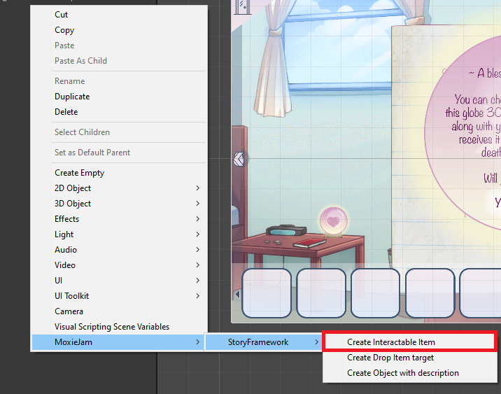
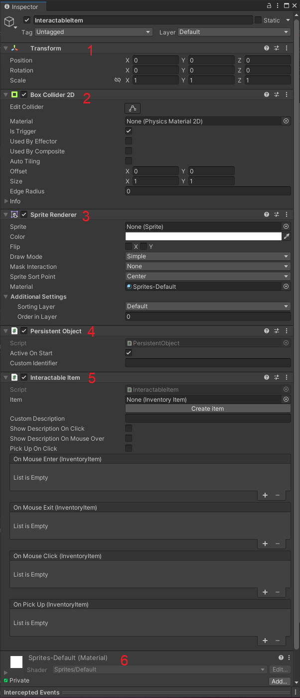

# MoxieJam Story Framework

The MoxieJam story framework contains a collection of components and tools to aid in creation of story based point-and-click games for the MoxieJam game jam.

## Create a interactable item

The easiest way to create a interactable item is to right click in the hierarchy window and in the menu select:

`MoxieJam->StoryFramework->Create Interactable Item`

A new window will now open with settings for the interactable item:

1. Name of the game object
2. What image to use
3. Weather it's possible to pick up the item or not.
4. A `Inventory Item` to associate with this object. This is the actual item that will be picked up in to the inventory. If you have not created the `Inventory Item` before hand, you can press `Create Item` to create one now.

Once you are satisfied with your settings you click `Create` and it will be available in the scene. If you have changed your mind about creating the object just click cancel.

You have now created a interactable item, congratulations! Select the newly created object in the hierarchy window and take a look in the inspector window. This is all the components of the intractable item you just created:

1. `Transform` decided where to place the object in the scene. You can also use it to rotate or change the size of the object.

## Create a target to drop an item on

