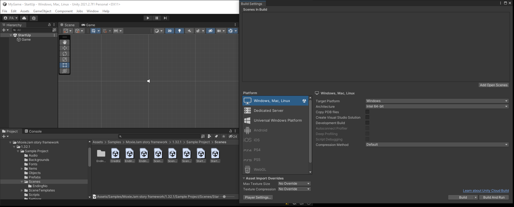

# Installation

This document will guide you through installing the advanced sample game project.

## Prerequisites

This document assume you have just created a new project and installed the MoxieJam Story framework.

## Install the sample game

The framework comes with some recommended assets to aid in creating your game. Among the assets is a scene template that will help you in creating a standard scene for your game.

To install this, inside the package manager window select the `MoxieJam story framework` package. On the right side of the window you can see a section called `Samples` click on the arrow next to it if this section isn't expanded yet. Click on `Import` next to `Sample Project` the sample will now be installed.

If you can't find the package manager, please refer to [Installation section](#install-the-moxiejam-story-framework) on where to find it.

## Install the sample game

The framework comes with a sample game that use much of the frameworks functionality. It is a good way of getting to know the framework.

To install this, inside the package manager window select the `MoxieJam story framework` package. On the right side of the window you can see a section called `Samples` click on the arrow next to it if this section isn't expanded yet. Click on `Import` next to `Storyframework Assets` the sample will now be installed.

If you can't find the package manager, please refer to [Installation section](#install-the-moxiejam-story-framework) on where to find it.

Once the sample project is installed, you will now have all the sample assets in your project view.

There is still one more thing to do before you can run the game. Unity need to know about the scenes in the game, so we will add them in the `Build settings`.

Open the `Build Settings` in the `File` menu.

A new window will now open with the current `Build Settings`. Inside here we want to add all scenes that belong to the project. So go to the `Scenes` folder inside the samples directory and select all the scene files and drag them to the area under `Scenes In Build`.

With all the scenes added, make sure that the scene named `StartUp` is first in the list. If it is not, select it in the list and drag and drop it at the top. This is important as this is the first scene unity will load when the game starts.

The scenes have now been added to the settings and it should looks something similar to this.

The sample project is now fully installed! Press on Play and try it out!
