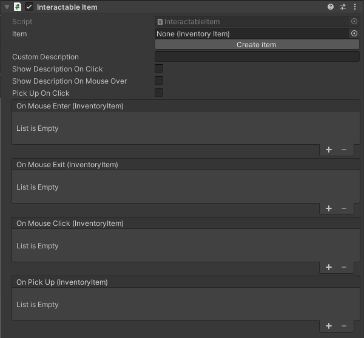

---
uid: component_interactable_item
title: Interactable Item
---
# Persistent Object

The interactable item is a composite component gathering often-used functionality relating to items:

* It allow you to pick up an item

## Settings

