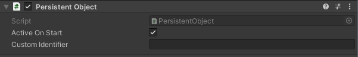

---
uid: component_persistent_object
title: Persistent Object
---
# Persistent Object

The persistent object component is used for two things:

* It allow for a game object to have a unique identifier that is used to remember the state of a object when entering and exiting scenes.
* It remembers if a game object was active (enabled) or not when entering and exiting a scene.

## Settings

### Active On Start

If this is enabled (default) the game object will be enabled (active) when entering the scene first time, otherwise it is hidden.

### Custom identifier

A persistent object have a internal generated identifer private to it. If you rather want to specify your own, this can be done in this field.

A custom identifier is useful if you want to  be able to refrence this game objects state from antoher scene (e.g. activate/deactivate a game object from another scene).