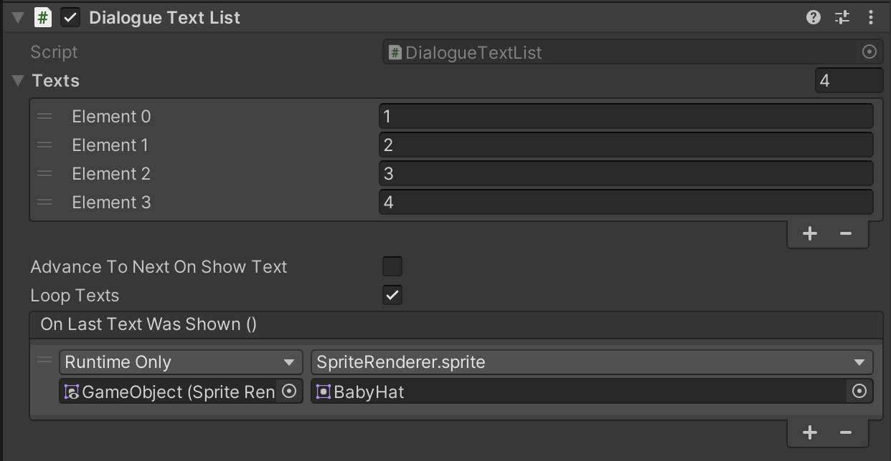

# Do If Item Is

A utility component for displaying one of multiple text in a dialogue.

## Settings

### Texts

A list of texts to display in the dialogue.

### Advance To Next On Show Text

If the component should advance to the next text in the list after showing text. (E.g. doing `Show Text` multiple times will show a next text from the list each time).

### Loop Texts

Whether to restart fom the first text again after showing the last text in the list.

## Events

The component provide some useful events you can use to make something happen when interacting with the component.

### On Last Text Was Shown

This event happens when the last text is being shown.

## Methods to use in events

* `AdvanceToNextText` select the next text in the list.
* `ShowText` shows the current text.
* `ShowTextIndex` shows a specific text in the list.
* `ShowRandomText` shows a random text from the list.
