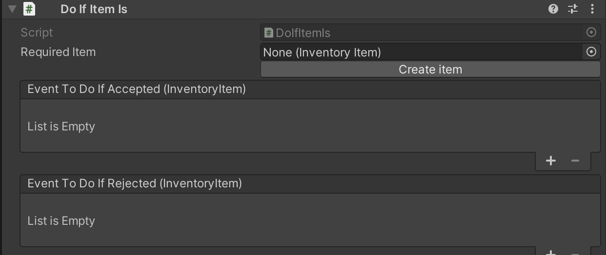

# Do If Item Is

The Do If Item Is component is useful for drop target actions to do conditional tests on the dropped item.

## Settings

### Required item

The item to test against.

## Events

The component provide some useful events you can use to make something happen when interacting with the component.

### On Item Accepted

This event happens if the user have passed the require item.

### On Item Rejected

This event happens if the user passed an item on this object and it was the wrong item.

## Related components

* <xref:component_drop_multi_item_target>