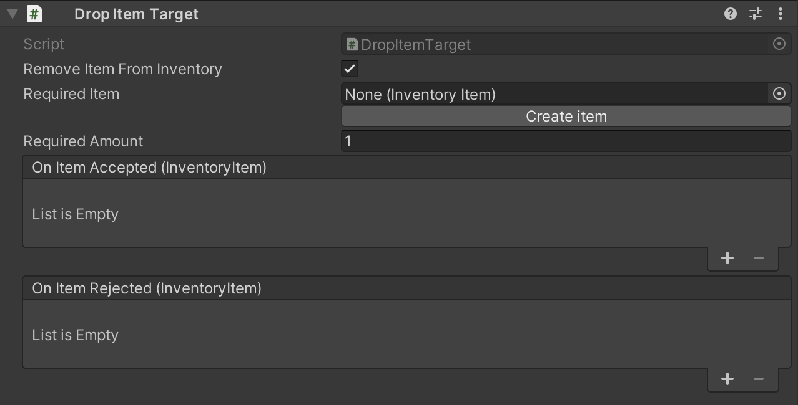

# Drop Item Target

The drop item target works as a drop target for Inventory Items when dragging them from the inventory. It is a basic building block for interactions in a point and click game that allow the user to combine items to perform actions. When a dropped item is accepted or rejected it calls an event.

## Settings

### Required item

If you want this component to only allow a certain item you can specify it here. 

## Required item amount

If the user can collect more than one of the item you can make it so the drop target only accept the item if it have a certain amount of it in its inventory.

## Events

The component provide some useful events you can use to make something happen when interacting with the component.

### On Item Accepted

This event happens if the user have dropped the require item (if any is needed) and have the required amount of the item in its inventory.

### On Item Rejected

This event happens if the user dropped and item on this object and it was either the wrong item or the user did not have enough of the item in the inventory.

## Related components

* <xref:component_inventory_item>
