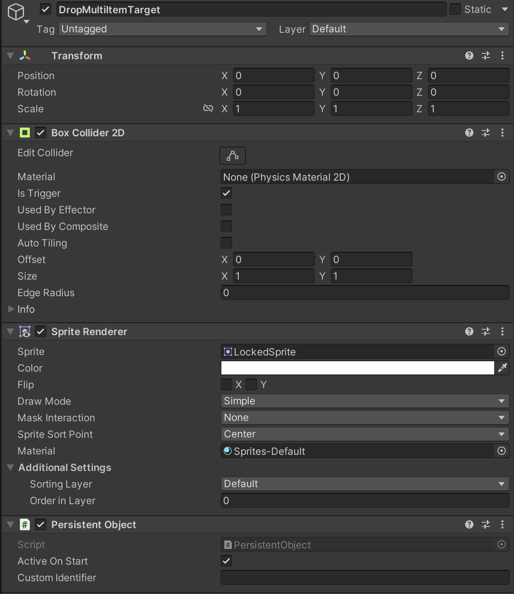
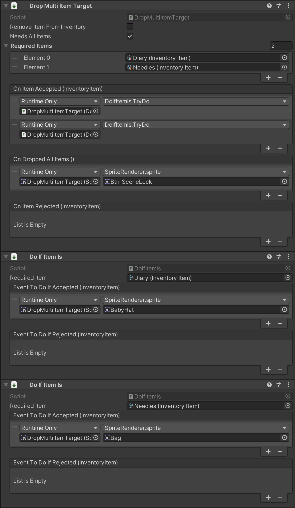

# Drop Multi Item Target

The drop item target works as a drop target for Inventory Items when dragging them from the inventory. It is a basic building block for interactions in a point and click game that allow the user to combine items to perform actions. When a dropped item is accepted or rejected it calls an event.

## Settings

### Remove Item From Inventory

Enable this if you want the item (or an amount of the item) to be removed from the inventory when item is accepted.

### Needs All Items

Enable this if you require the user to drop one of each of the items. If this is enabled, the event On Dropped All Items happens once all items have been dropped. It will only accept dropping one of each item once.

### Required items

If you want this component to only allow a certain items you can specify them here. 

## Events

The component provide some useful events you can use to make something happen when interacting with the component.

### On Item Accepted

This event happens if the user have dropped the require item (if any is needed) and have the required amount of the item in its inventory.

### On Dropped All Items

This event happens if the user have dropped all the required item (if any is needed). It requires the `Needs All Items` setting to be enabled.

### On Item Rejected

This event happens if the user dropped and item on this object and it was either the wrong item or the user did not have enough of the item in the inventory.

## Example

Here is a example that needs two items, a diary and needles.

If the user drops either of the items it will do the `On Item Accepted` actions and pass the dropped item on to the `Do If Item Is` components. They will in turn test if the item is the required item. If it is, it will change the sprite image to another.

If the user have dropped both a diary and needles on the target, it will now do what the `On Dropped All Items` action and change the sprite image again to a lock.

## Related components

* <xref:component_inventory_item>
* <xref:component_do_if_item_is>
