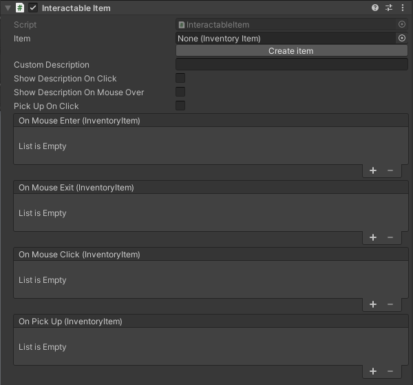

# Interactable Item

The interactable item is a composite component gathering often-used functionality relating to items:

* It allow you to pick up an Inventory Item
* See some descriptive text in the dialogue when user click and/or have the mouse over.
* Do some action when mouse is over, clicking or when picking up the item (see Events section).

## Settings

### Item

A item to associate with this component. This is the item that would be picked up if the user clicks on this component. The item also provide the default description text.

## Custom description

If you do not want to use the description provided in the items settings you can override it with this text.

Leave empty to use the items text.

## Events

The component provide some useful events you can use to make something happen when interacting with the component.

### On Mouse enter

This event happens when the mouse cursor enter over this object.

### On Mouse exit

This event happens when the mouse cursor exit from this object.

### On Mouse click

This event happens when the user clicks on this object.

### On Pick Up

This event happens the moment the user clicks to pick up the item.

## Related components

* <xref:component_inventory_item>
