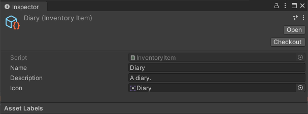
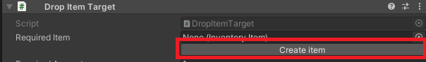
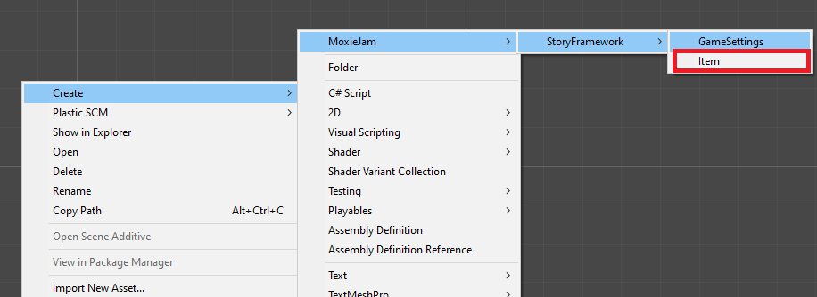

---
uid: component_inventory_item
title: Inventory Item
---
# Inventory Item

A inventory item represent a object that can be placed in the inventory. You can assign one to a `Interactable Item` (see <xref:component_interactable_item>) to allow it to be picked up in to the inventory. It is also used when dragging from the inventory and dropping on the `Drop Item Target` (see <xref:component_drop_item_target>).

## Creating

You can create a inventory item in two ways:

1. On a component that uses items you can create one if none is selected yet.

The other option is to right click in a folder in your project and select `Create->MoxieJam->StoryFramework->Item`

## Settings

### Name

A name for the item.

### Description

A description of the item, used by the inventory to display information in the dialogue.

### Icon

A graphical representation of the item. Used by the inventory to display the item. Also used when dragging the item from the inventory.

## Related components

* <xref:component_inventory_item>
* <xref:component_drop_item_target>
