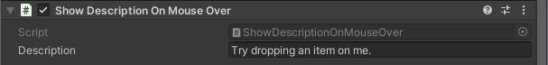

---
uid: component_show_description_on_mouse_over
title: Show Description On Mouse Over
---
# Show Description On Mouse Over

This component allows use to display some text when user have the mouser over the object.

## Settings

### Description

The text to display in the dialogue
