# Installation

This document will guide you through creating a new Unity-project and installing the framework.

## Prerequisites

This package requires Unity version 2021.2.7f1 (newer version might potential work but can't be guaranteed).

## Create a new project

Open Unity Hub and click on `New Project`

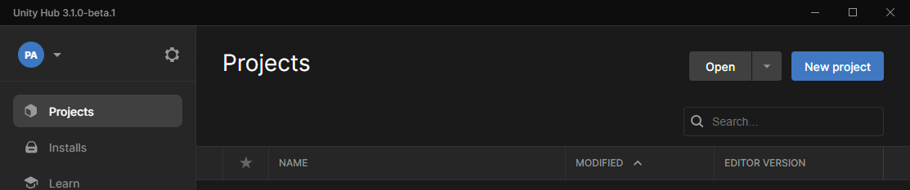

In this new screen you customize your new project:

* Make sure that the Editor Version at the top of the screen is set to the correct version (see [Prerequisites](#prerequisites) section)
* Select the core template named `2D`.
* Name your project in the `Project Settings` section.
* Change the `Location` to where you would like to save your project.

When you are satisfied with settings press `Create project`.

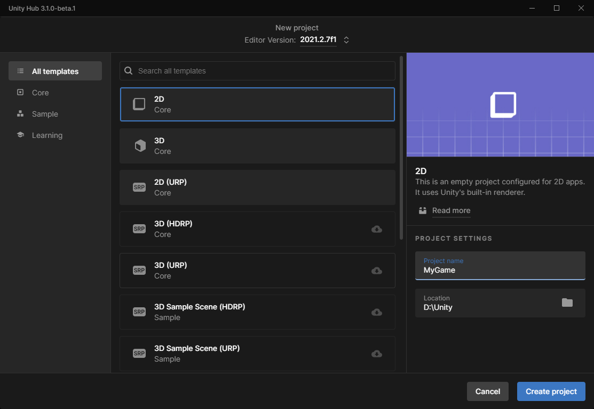

Unity will now open your newly created project (if this did not happen, open the project through the Unity Hub).

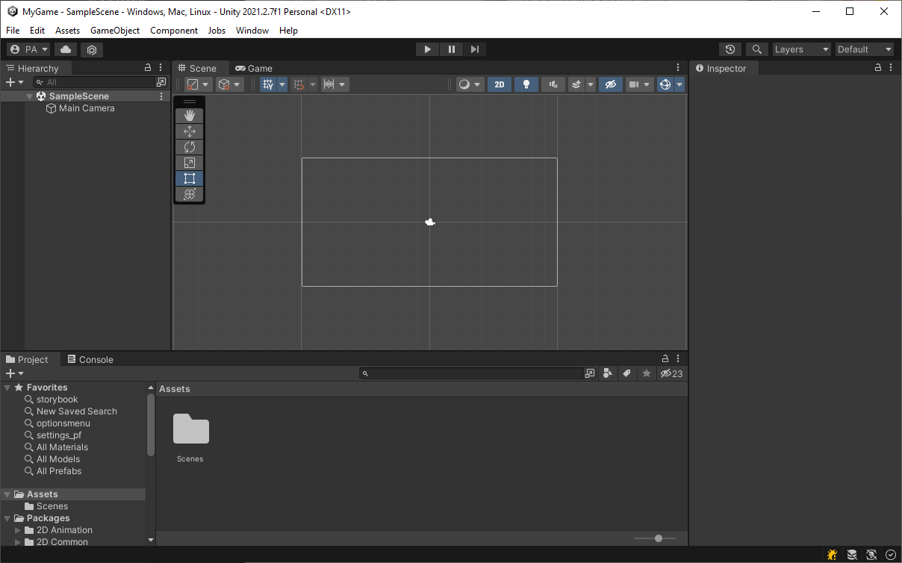

Now you are ready to install the MoxieJam Story Framework!

## Install the MoxieJam Story Framework

In the `Window` menu in unity click on `Package Manager`.

A new window with the `Package Manager` is now opened. Press the `+` menu in the top left corner and click on `Add package from git URL...`.

In this new window paste in the MoxieJam Story Frameworks URL:

`https://github.com/gamehabitat/moxiejam_storyframework.git`

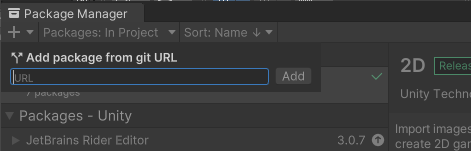

Unity's package manager will now start downloading and installing the package. Once it is completed you will see a green checkmark to the right of the version number of the package.

### Install TextMeshpro resources

Once the package is installed a window named `TMP Importer` might appear and ask you to `Import TMP Essentials` go ahead and do this as it will add some needed assets to make texts in the game work.

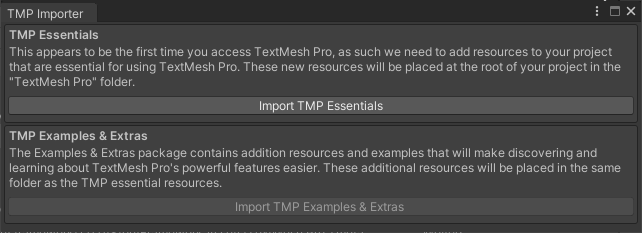

If this window did not open up, instead in the `Window` menu under the sub-menu `TextMeshPro` click on `Import TMP Essential Resources` to import them.

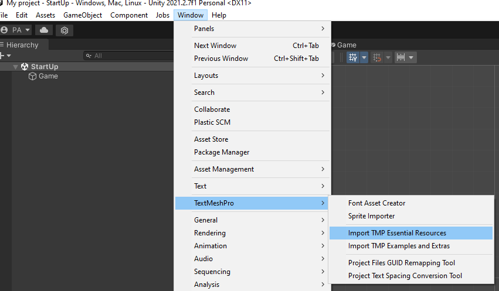

When you start importing a new window will open up. Click `Import` in the lower right corner of it to start importing.

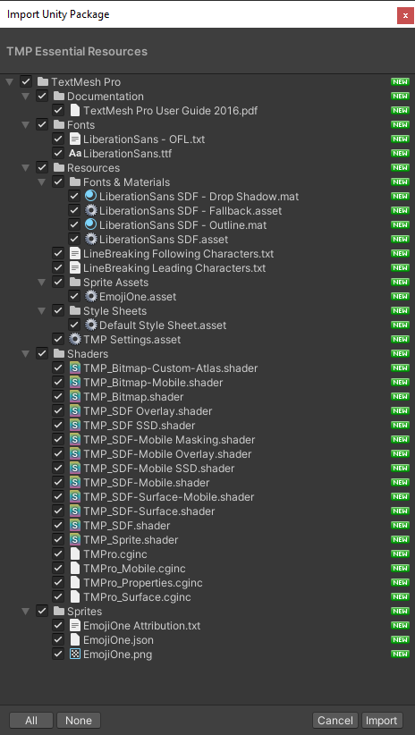

The TextMeshPro resources is now installed.

### After installation

When the package is installed you can optionally install the recommended [StoryFramework Assets](#install-recommended-framework-assets) and / or the [Sample Project](#install-the-sample-game).

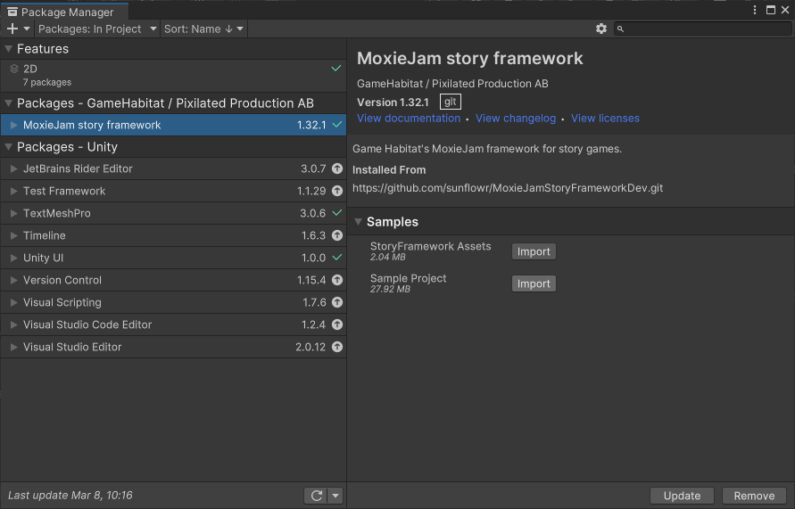

## Install recommended framework assets

The framework comes with some recommended assets to aid in creating your game. Among the assets is a scene template that will help you in creating a standard scene for your game.

To install this, inside the package manager window select the `MoxieJam story framework` package. On the right side of the window you can see a section called `Samples` click on the arrow next to it if this section isn't expanded yet. Click on `Import` next to `Sample Project` the sample will now be installed.

If you can't find the package manager, please refer to [Installation section](#install-the-moxiejam-story-framework) on where to find it.

## Install the sample game

The framework comes with a sample game that use much of the frameworks functionality. It is a good way of getting to know the framework.

To install this, inside the package manager window select the `MoxieJam story framework` package. On the right side of the window you can see a section called `Samples` click on the arrow next to it if this section isn't expanded yet. Click on `Import` next to `Storyframework Assets` the sample will now be installed.

If you can't find the package manager, please refer to [Installation section](#install-the-moxiejam-story-framework) on where to find it.

Once the sample project is installed, you will now have all the sample assets in your project view.

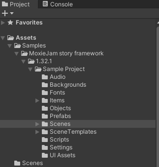

There is still one more thing to do before you can run the game. Unity need to know about the scenes in the game, so we will add them in the `Build settings`.

Open the `Build Settings` in the `File` menu.

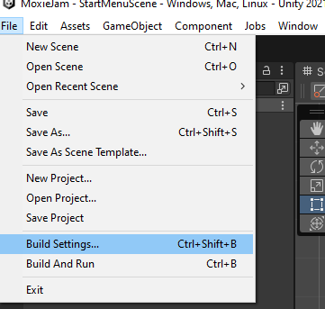

A new window will now open with the current `Build Settings`. Inside here we want to add all scenes that belong to the project. So go to the `Scenes` folder inside the samples directory and select all the scene files and drag them to the area under `Scenes In Build`.

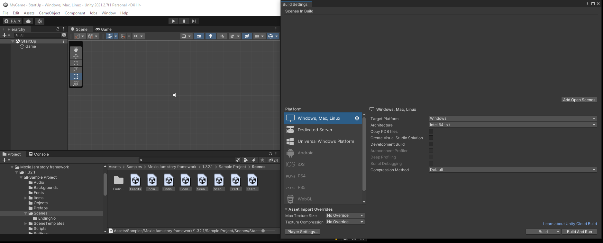

With all the scenes added, make sure that the scene named `StartUp` is first in the list. If it is not, select it in the list and drag and drop it at the top. This is important as this is the first scene unity will load when the game starts.

The scenes have now been added to the settings and it should looks something similar to this.

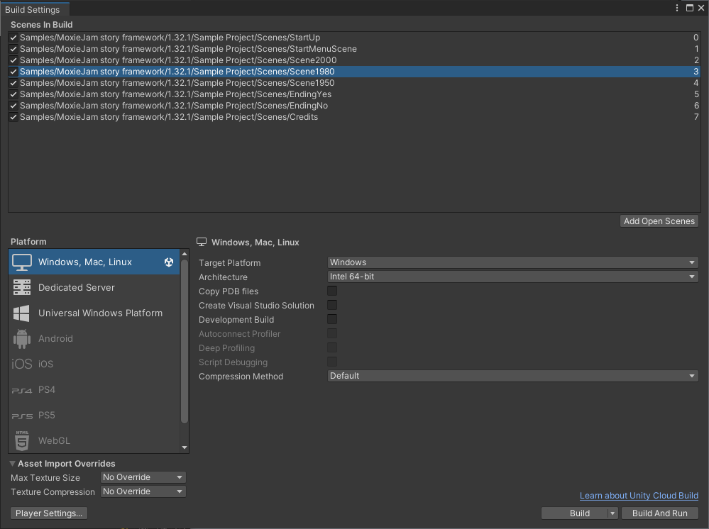

The sample project is now fully installed! Press on Play and try it out!
