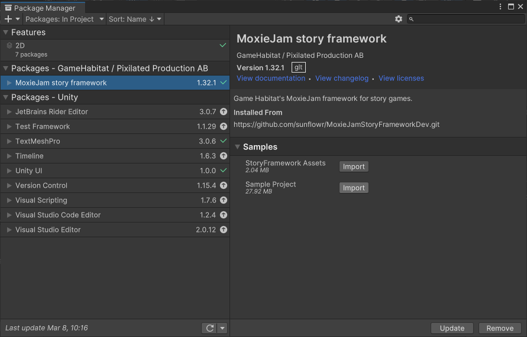

# Installation

Due to potential incompatibilities with newer version of MoxieJam framework your project form 2022 might not work as intended. This document will guide you through installing the framework used during MoxieJam 2022.

Once Unity is open it will try and install the latest version of the framework, we do not want this, but rather a specific version. To fix this you need to change the URL for the MoxieJam Story Framework.

## Prerequisites

This package requires Unity LTS version 2021.3.19f1 (newer version might potential work but can't be guaranteed).

## Installing the framework through Unity.

Open your project with Unity.

## Install the MoxieJam 2022 Story Framework

In the `Window` menu in unity click on `Package Manager`.

A new window with the `Package Manager` is now opened. You should `MoxieJam story framework` listed on the left side. This is the thing that we will replace with a specific version.

Inside this window, Select `MoxieJam story framework` and then in the bottom right corner click on the `Remove` button.

A new window will pop up asking you to confirm if you want to remove this package. Click the `Remove` button and wait for Unity to finish removing the package. You might notice some errors in the status bar of Unity after this. You can safely ignore them as we will automatically fix this once we install MoxieJam story framework again.

So once the package has been removed you can press the `+` menu in the top left corner and click on `Add package from git URL...`.

In this new window paste in the MoxieJam Story Frameworks URL:

`https://github.com/gamehabitat/moxiejam_storyframework.git#moxiejam2022`

Unity's package manager will now start downloading and installing the package. Once it is completed you will see a green checkmark to the right of the version number of the package.

Congratulations, now your project should be using the MoxieJam 2022 story framework again.
