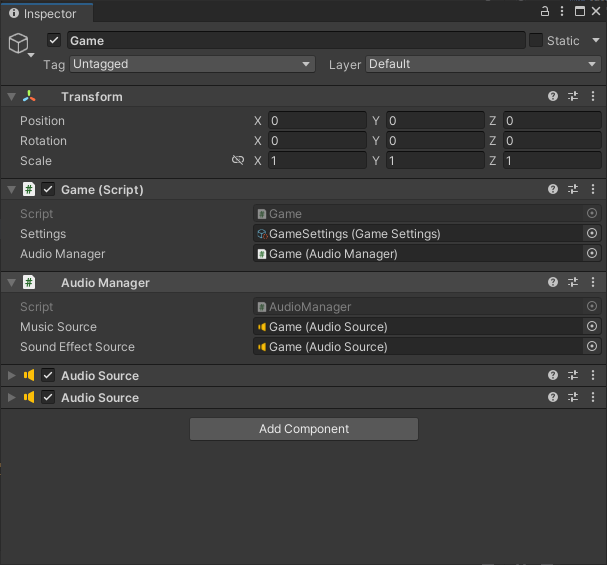
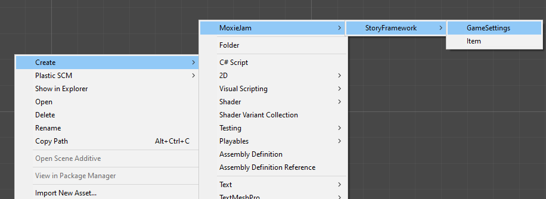

---
uid: tutorials_advanced_topics
title: Advanced Topics
---
# Advanced

## Starting from scratch

The MoxieJam needs at least StartUp scene, A menu scene and a in-game scene.

### Start Up scene

The `Start Up` scene sets up the MoxieJam framework. A typical scene contains a single game object:



* The `Game` script will make it self available during the entire game session. It provides functionality for loading scenes and other general things.
* The `Audio Manager` handles playing of music and sound effects and will also be available while game is running.
* The last two `Audio Source` is used by the audio manager to play the music and sound effects.

The game script requires a `Settings` file. To create it right click in a folder in the project and select `Create->MoxieJam->StoryFramework->GameSettings`.



The game settings tells the game what next scene to load next after the initial setup.

### Menu scene

The menu scene usually have at least two things:

1. A way to start the game (load the in-game scene) with a new game state.
2. Quit the game

To do this you will need to create at least a simple menu script to handle these two scenarios.

Here is a simple example when a setting for what scene to load when starting a new game.

```c#
using UnityEngine;
using StoryFramework;

public class SimpleMenu : MonoBehaviour
{
    [SerializeField]
    SceneRef firstInGameScene;

    public void StartGame()
    {
        Game.StartNewGame(firstInGameScene);
    }

    public void QuitGame()
    {
        Game.Quit();
    }
}
```

`Game.StartNewGame()` will create a new empty game state and load the specified scene.

### Game scene

The game scene requires a `In Game Scene` script on a game object and a `Ingame UI` script. These two initialize the scene and the UI.

`In Game Scene` sets the active UI in this scene.

`Ingame UI` is used to set the active dialogue, cursor handler and inventory view.

* `Cursor handler` handle the dragging and droppging logic of items.
* `Inventory view` handles the graphical part of the inventory.

## Modifying the framework

If you feel something is missing you can:

1. Fork the GitHub repository and install using your own github url.
2. You can download the source from github and install it in your project locally (in package manager "Add package from disk..."). Note if you do this it might not be shared if you collaborate with others using source control (e.g. PlasticSCM).

[Source code on GitHub](https://github.com/gamehabitat/moxiejam_storyframework)
