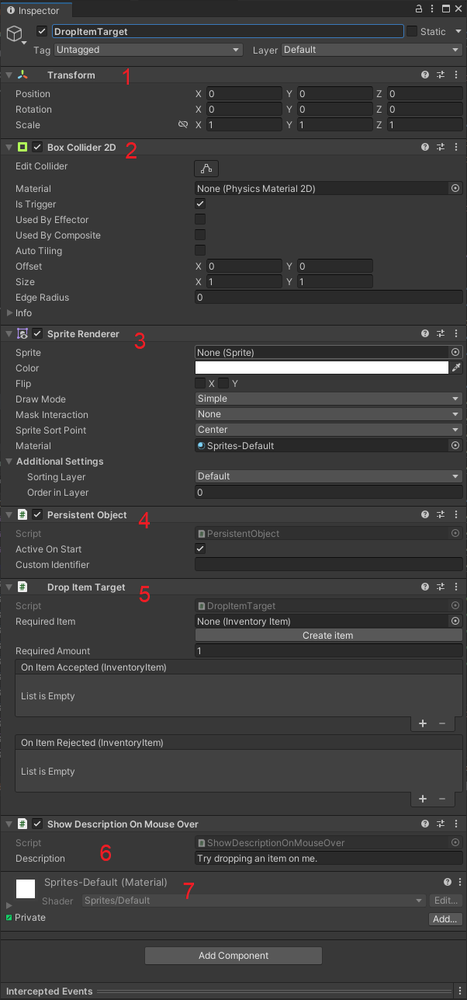

---
uid: create_drop_item_target
title: Create a Drop Item Target
---
# Create a drop item target

A drop item target, pretty much does what it is called - it is a object you can dag and drop inventory items on.

When a inventory item is dropped it can either be accepted or rejected depending on if you configured it to only accept a certain `Inventory Item` or a certain amount of the `Inventory Item`.

## Create a target to drop an item on

The easiest way to create a drop item target is to right click in the hierarchy window and in the menu select:

`MoxieJam->StoryFramework->Create Drop Item Target`

You have now created a drop item target, congratulations! Select the newly created object in the hierarchy window and take a look in the inspector window. This is all the components of the object you just created:

1. `Transform` decided where to place the object in the scene. You can also use it to rotate or change the size of the object.
2. `Box Collider 2D` is used to decide the clickable/mouser-over area of the object.
3. `Sprite Renderer` like the name implies is used to render (draw) the sprite. You can assign a `Sprite` (image) here and do things such as flip it, and change what layer and order it's being drawn.
4. See <xref:component_persistent_object>.
5. See <xref:component_drop_item_target>
6. See <xref:component_show_description_on_mouse_over>
7. The last component is the material used by the `Sprite Renderer` to draw the image.

8. 
