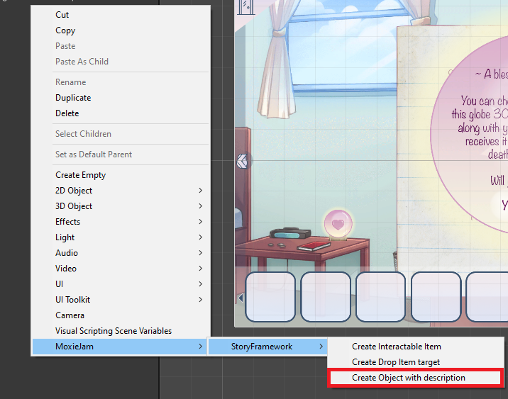
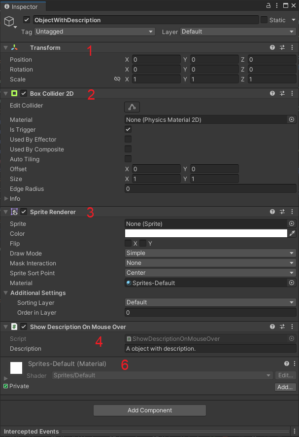

---
uid: create_object_with_description
title: Create a object with description
---
# Create a object with description

This is a simple but useful object that allows you display text in the dialogue when you have the mouse cursor over an object in the scene.

## Create a target to drop an item on

The easiest way to create a object with description is to right click in the hierarchy window and in the menu select:

`MoxieJam->StoryFramework->Create Object with description`

You have now created a object with description, congratulations! Select the newly created object in the hierarchy window and take a look in the inspector window. This is all the components of the object you just created:

1. `Transform` decided where to place the object in the scene. You can also use it to rotate or change the size of the object.
2. `Box Collider 2D` is used to decide the clickable/mouser-over area of the object.
3. `Sprite Renderer` like the name implies is used to render (draw) the sprite. You can assign a `Sprite` (image) here and do things such as flip it, and change what layer and order it's being drawn.
4. See <xref:component_show_description_on_mouse_over>.
6. The last component is the material used by the `Sprite Renderer` to draw the image.

7. 
